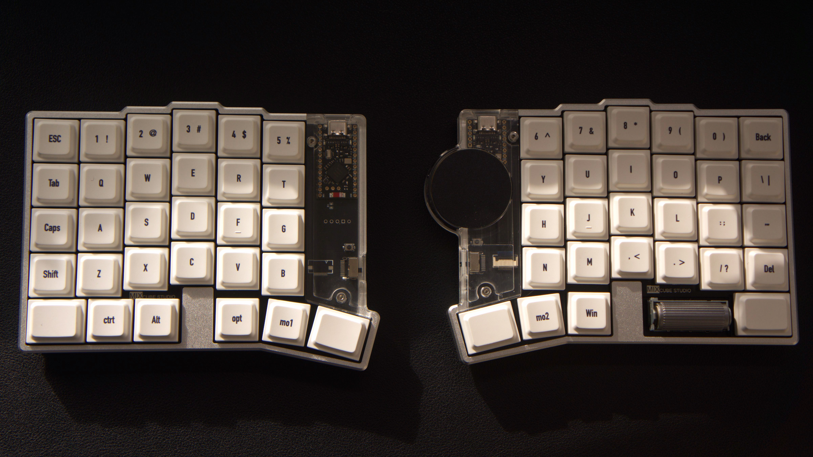

# MIX ZMK Firmware




**MIX** is a wireless split low-profile keyboard project by **CUBE_STUDIO**.
This repository contains the ZMK firmware configuration for MIX, including split-half builds, display support, pointing-device support, encoder support, Bluetooth profiles, and ZMK Studio configuration.

Official store: [cubekb.net](https://cubekb.net)
Contact: [cube_studio@qq.com](mailto:cube_studio@qq.com)

中文简介：本仓库是 **CUBE_STUDIO MIX 无线分体矮轴键盘** 的 ZMK 固件配置仓库，用于生成左右手固件、配置按键层、显示屏、触控板/指针设备、旋钮以及蓝牙连接相关功能。

购买地址：[cubekb.net](https://cubekb.net)
联系邮箱：[cube_studio@qq.com](mailto:cube_studio@qq.com)

---

## Features

* Wireless split keyboard firmware based on **ZMK**
* Built for **nice!nano v2** controllers
* Split-half targets: `mix_left` and `mix_right`
* Display support with `nice_view_adapter` and `nice_epaper`
* ZMK Studio enabled for visual keymap editing / runtime configuration support
* Pointing-device and mouse support for Cirque-style trackpad integration
* EC11 rotary encoder support
* Bluetooth profile management layer
* Sleep and idle timeout configuration for wireless use
* Official store: [cubekb.net](https://cubekb.net)
* Contact email: [cube_studio@qq.com](mailto:cube_studio@qq.com)
* Community support via QQ group: **1037094476**

---

## Build Targets

The current `build.yaml` generates the following firmware targets:

| Target         | Board          | Shield / Snippet                         | Notes                                           |
| -------------- | -------------- | ---------------------------------------- | ----------------------------------------------- |
| Left half      | `nice_nano_v2` | `mix_left nice_view_adapter nice_epaper` | Left-side firmware with display stack           |
| Right half     | `nice_nano_v2` | `mix_right` + `studio-rpc-usb-uart`      | Right-side firmware with ZMK Studio RPC enabled |
| Settings reset | `nice_nano_v2` | `settings_reset`                         | Used to clear stored ZMK settings               |

---

## Keymap Overview

The current keymap includes four main layers:

| Layer    | Display Name | Purpose                                   |
| -------- | ------------ | ----------------------------------------- |
| `LAYER0` | `Default`    | Main typing layer                         |
| `LAYER1` | `layer 1`    | Function keys and brackets                |
| `LAYER2` | `layer 2`    | Symbols and shifted number-row characters |
| `LAYER3` | `Bluetooth`  | Bluetooth profile selection and clearing  |

### Default Layer Highlights

* Number row and standard QWERTY alpha layout
* Dedicated `ESC`, `TAB`, `CAPS`, `SHIFT`, `CTRL`, `ALT`, `GUI`, `SPACE`, `ENTER`, and `BACKSPACE`
* Momentary layer access through `&mo 1` and `&mo 2`
* Bluetooth layer access through `&lt 3 SPACE`
* Encoder bindings for volume and scrolling

### Bluetooth Layer

`LAYER3` provides quick Bluetooth controls:

* `BT_SEL 0` to `BT_SEL 4` for profile switching
* `BT_CLR` for clearing the current profile
* `BT_CLR_ALL` for clearing all Bluetooth profiles

---

## Repository Structure

```text
.
├── build.yaml              # GitHub Actions build matrix
├── config/
│   ├── west.yml            # ZMK and external module manifest
│   ├── mix.conf            # Runtime/build configuration
│   └── mix.keymap          # Keymap layers, combos, and sensor bindings
└── README.md
```

External modules currently referenced by `west.yml`:

* `zmkfirmware/zmk` at `v0.3`
* `petejohanson/cirque-input-module`
* `mctechnology17/zmk-nice-oled`

---

## Firmware Configuration

Main options enabled in `config/mix.conf`:

```conf
CONFIG_ZMK_STUDIO=y
CONFIG_ZMK_STUDIO_LOCKING=n
CONFIG_ZMK_STUDIO_LOCK_ON_DISCONNECT=n

CONFIG_EC11=y
CONFIG_EC11_TRIGGER_GLOBAL_THREAD=y

CONFIG_ZMK_POINTING=y
CONFIG_ZMK_MOUSE=y

CONFIG_ZMK_DISPLAY=y
CONFIG_ZMK_DISPLAY_STATUS_SCREEN_CUSTOM=y

CONFIG_ZMK_SLEEP=y
CONFIG_ZMK_IDLE_TIMEOUT=450000
CONFIG_ZMK_IDLE_SLEEP_TIMEOUT=1800000

CONFIG_BT_CTLR_TX_PWR_PLUS_8=y
CONFIG_ZMK_BLE_EXPERIMENTAL_CONN=y
```

---

## Building Firmware with GitHub Actions

1. Fork or clone this repository.
2. Edit `config/mix.keymap` or `config/mix.conf` as needed.
3. Commit and push your changes to GitHub.
4. Open the **Actions** tab in this repository.
5. Wait for the ZMK build workflow to finish.
6. Download the generated firmware artifact.
7. Unzip the artifact and flash the correct `.uf2` file to each half.

---

## Flashing

1. Connect one half of the keyboard to your computer with USB.
2. Double-click the reset button to enter bootloader mode.
3. A removable drive should appear.
4. Copy the corresponding `.uf2` firmware file to the drive.
5. Wait for the board to reboot automatically.
6. Repeat for the other half.

Recommended first-time flashing order:

1. Flash `settings_reset` to both halves if you are switching from another firmware/config.
2. Flash `mix_left` firmware to the left half.
3. Flash `mix_right` firmware to the right half.
4. Re-pair the keyboard through Bluetooth if needed.

---

## Editing the Keymap

The main keymap file is:

```text
config/mix.keymap
```

After editing the keymap:

```bash
git add config/mix.keymap
git commit -m "Update MIX keymap"
git push
```

GitHub Actions will rebuild the firmware automatically if the workflow is enabled.

---

## ZMK Studio

This configuration enables ZMK Studio support through:

* `CONFIG_ZMK_STUDIO=y`
* `studio-rpc-usb-uart` snippet on the `mix_right` build target

Use ZMK Studio to inspect or adjust supported runtime keymap features through a visual interface.

---

## Notes

* This repository is intended for MIX keyboard firmware development and customization.
* Hardware revisions may require matching shield, pin, display, and pointing-device configuration.
* If Bluetooth pairing behaves unexpectedly, flash `settings_reset` and pair again.
* If the display, encoder, or trackpad does not work, check the shield overlay and module versions first.

---

## Community & Support

Official store: [cubekb.net](https://cubekb.net)
Email: [cube_studio@qq.com](mailto:cube_studio@qq.com)
CUBE_STUDIO QQ group: **1037094476**

Feel free to join the group or contact us by email for build help, firmware discussion, MIX keyboard updates, and customization support.

---

## Credits / Upstream Projects

This repository is a keyboard firmware configuration based on the ZMK ecosystem.
The following upstream projects and modules are used or referenced by this firmware configuration:

* **ZMK Firmware**: [zmkfirmware/zmk](https://github.com/zmkfirmware/zmk)
* **nice!view / nice!oled related module**: [mctechnology17/zmk-nice-oled](https://github.com/mctechnology17/zmk-nice-oled)
* **Cirque trackpad input module**: [petejohanson/cirque-input-module](https://github.com/petejohanson/cirque-input-module)

Please refer to each upstream project for its original license, documentation, and usage requirements.
